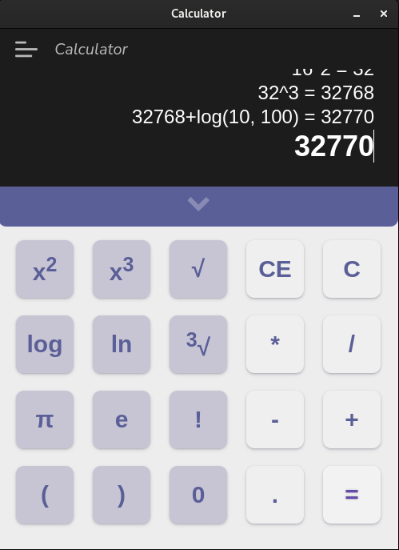

<h1 align="center">IVS Project 2</h1>

<p align="center">
    
    
    
    
    
    <br>
    <h4 align="center">Environment</h3>
    <p align="center">
        
    </p>
    <br>
</p>

<p align="center">Our take on the second project from the Practical Aspects of Software Design subject.</p>
<br>

## Authors
Team KVM Switchers
- [xvalenk00 | @chadmee](https://www.github.com/chadmee)
- [xkocio00 | @Otas02CZ](https://www.github.com/Otas02CZ)
- [xmendlm00 | @Mr-Annonym](https://www.github.com/Mr-Annonym)


## Documentation
This section provides a concise overview of the project's functionality and features. It outlines how to use the calculator, including descriptions of supported mathematical operations such as addition, subtraction, multiplication, and division. Additionally, it covers more advanced functionalities like factorial computation, exponentiation with natural exponents, and general root extraction.

Find the user documentation **[here.](https://otas02cz.github.io/ivs_project_kvm_switchers/)**

The user documentation also includes installation details, software and hardware requirements, and usage instructions. Please refer to the documentation **above** for more information.

## Math engine library

The Math engine library is our in-house made tool that allows you to evaluate string-based equations with support for various mathematical operations. It provides a convenient way to perform calculations and obtain results in a simple and efficient manner.

Here are the supported mathematical operations:

- Addition: Use the format `6 + 1` to add two numbers.
- Subtraction: Use the format `5 - 4` to subtract one number from another.
- Multiplication: Use the format `12 * 2` to multiply two numbers.
- Division: Use the format `6 / 2` to divide one number by another.
- Power: Use the format `pow(base, exponent)` to calculate the power of a base raised to an exponent.
- Natural root: Use the format `root(base, exponent)` to calculate the natural root of a number.
- Factorial: Use the format `6!` to calculate the factorial of a number.
- Natural logarithm: Use the format `log(base, value)` to calculate the natural logarithm of a value.

<br>

To use the Math engine library, you can create an instance of the `MathEngine` class and call its `solveEquation` method, passing in the equation as a string. The method will return a string with the result of the equation or throw an error if the equation format is invalid or if any other error occurs.

<br>

### Math engine library interface

Is implemented in file ```/src/js/math_engine.js```
```javascript
class MathEngine {

  ...
  // inner implementation
  ...

  //takes equation defined in string and returns string with result or throws an error
  solveEquation(equation) {
    return string_with_result;
  }

  ...
  // inner implementation
  ...

}

...

modules.exports = MathEngine;
```

<br>

## Exceptions in the Math Engine Library

The Math Engine Library provides a robust error handling mechanism to handle various exceptional scenarios. When using the library, you may encounter the following exceptions:

| Exception             | Error Message                           |
|-----------------------|-----------------------------------------|
| EqvFormatError        | The equation format must be valid.       |
| RangeError            | The value must be within a valid range.  |
| DivisionByZeroError   | The divisor value must not be zero.      |
| TypeError             | The values must be numbers.              |
| FactorialValueError   | Incorrect input for factorial.           |

These exceptions are designed to help you identify and handle errors that may occur during equation solving. The `EqvFormatError` exception is thrown when the equation format is invalid. The `RangeError` exception is thrown when a value is outside the acceptable range. The `DivisionByZeroError` exception is thrown when the divisor value is zero. The `TypeError` exception is thrown when the values provided are not numbers. The `FactorialValueError` exception is thrown when the input for factorial is incorrect.

When an exception is thrown, you can catch it using standard error handling techniques in your code. By handling these exceptions appropriately, you can ensure the reliability and accuracy of your calculations.

### Custom Error Handling

While the Math Engine Library provides robust error handling for common mathematical operations, there may be scenarios that require custom error handling logic. If you encounter a situation that is not covered by the provided exceptions, you can implement your own error handling to handle it. If you need assistance or have questions about implementing custom error handling, you can open an [issue in the repository](https://github.com/Otas02CZ/ivs_project_kvm_switchers/issues/new/choose) and provide details about the error and your environment.

To learn more about the Math Engine Library and its usage, refer to the documentation provided in the [Math engine library](#math-engine-library) section.

### Testing the library

We have implemented comprehensive unit tests for the Math Engine library to ensure its functionality and reliability. These tests cover various aspects of the library's interface and functionality, including equation solving, error handling, and edge cases.

The unit tests are written using the Jest framework and can be found in the file `/src/js/math_engine.test.js`. To run the tests, navigate to the `src` directory and execute the command `npm test` or `npx jest`. Make sure to install the dependencies defined in `package.json` by running `npm install` before running the tests.

By running these tests, you can verify that the Math Engine library performs as expected and handles different scenarios correctly. This helps ensure the accuracy and robustness of the library.

If you make any modifications or additions to the Math Engine library, it is important to update the corresponding unit tests to reflect the changes. This will help maintain the integrity of the library and prevent regressions.

<br>

## Environment

*The project is developed using the following technologies:*

- ```Electron```: A framework for building cross-platform desktop applications using web technologies such as HTML, CSS, and JavaScript.
- ```HTML5```: The latest version of the Hypertext Markup Language used for structuring and presenting content on the web.
- ```CSS```: Cascading Style Sheets used for styling the HTML elements.
- ```JavaScript```: A programming language used for adding interactivity and dynamic behavior to web pages.
- ```Ubuntu 22.04 LTS (64-bit)```: The operating system used for development and testing.

*The project also utilizes the following libraries and tools:*

- ```Math Engine Library```: A library that evaluates string-based equations with support for various mathematical operations.
- ```Jest```: A JavaScript testing framework used for writing unit tests for the Math Engine Library.

The project follows the ```CommonJS module format``` for organizing and importing modules.

<br>

## Electron Integration

The application utilizes Electron, a framework that allows for the integration of front-end and back-end technologies into a single application. With Electron, you can build cross-platform desktop applications using web technologies such as HTML, CSS, and JavaScript.

By leveraging Electron, our application combines the power of HTML5, CSS, and JavaScript to create a seamless user experience. The front-end components, including the user interface and visual elements, are built using HTML and CSS. JavaScript is used to handle user interactions and perform dynamic operations.

On the back-end, Electron provides a Node.js runtime environment, allowing us to use JavaScript to access system resources and perform tasks that are typically reserved for server-side programming. This integration enables us to interact with the underlying operating system, access files, and perform other system-level operations.

Overall, Electron simplifies the development process by providing a unified platform for building desktop applications with web technologies. It allows us to leverage our existing web development skills and tools while delivering a native-like experience to our users.

<br>

## Demo
To give you a glimpse of our application, here are some pictures and gifs showcasing its features and user interface.


*The main screen of our application, where users can perform calculations and evaluate equations.*


*A gif demonstrating the functionality of the application as user inputs and equation.*


*A gif demonstrating the menu feature of our application.*


<br>

## Standard deviation

The standard deviation is a measure of the amount of variation or dispersion in a set of values. It quantifies the spread of data points around the mean or average value.

To calculate the standard deviation, use the `std_dev.js` file located at `src/js/std_dev.js` within the repository. 

Here is an example usage of the std_dev.js file:

```zsh
foo@bar:~$ node std_dev.js < data.txt
```


## Miscellaneous

[Project motivation](https://youtu.be/UR7tujNjfo4)
